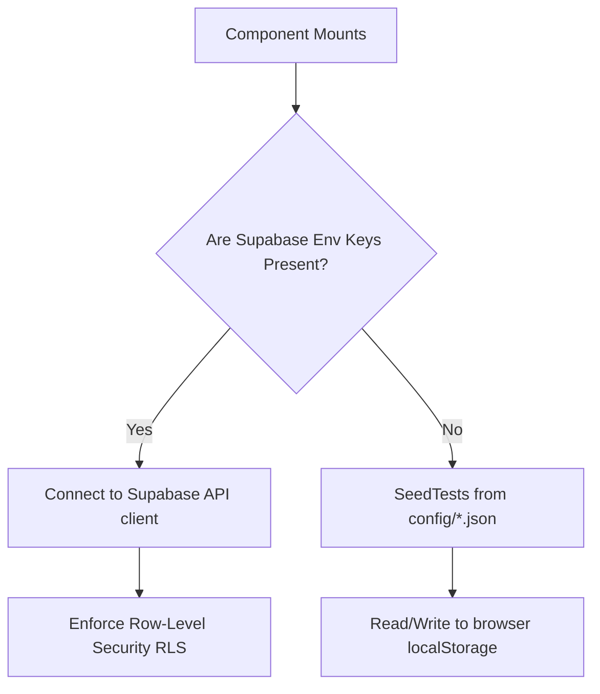

# 🏗️ Architecture & Technical Design Guide

This document outlines the technical design, routing structure, and component interaction flows of the wedding website.

---

## 🛠️ Technology Stack

* **Framework**: [Next.js](https://nextjs.org/) (React 19, TypeScript, App Router)
* **Styling**: Vanilla CSS with [PostCSS](https://postcss.org/) and native CSS Custom Properties for responsive variables
* **Animations**: [Framer Motion](https://www.framer.com/motion/) for micro-interactions, page transitions, and slide animations
* **Icons**: [Lucide React](https://lucide.dev/) for clean SVG interface icons
* **Database & Auth**: [Supabase](https://supabase.com/) client-side & server-side endpoints
* **Maps**: [Mapbox GL JS](https://docs.mapbox.com/mapbox-gl-js/) via `@vis.gl/react-mapbox`
* **AI Engine**: Google Gemini via the Vercel AI SDK (`ai` and `@ai-sdk/google`)

---

## 📂 Codebase Directory Layout

```
├── config/                 # Active website configurations & data
├── config.default/         # Template fallback configurations
├── database_backups/       # Supabase backup JSON dumps
├── docs/                   # Technical documentation guides
├── public/                 # Static media assets, icons, and fonts
├── scratch/                # Administrative utility scripts
├── scripts/                # Build and deployment shell scripts
└── src/
    ├── app/                # Next.js App Router routes & API endpoints
    ├── components/         # Reusable React UI components
    └── lib/                # Database clients, helpers, and exporters
```

---

## 🔄 Dual-Database Mode Architecture

To support zero-config cloning, local testing, and database-first production deployments, the app uses a dual-engine architecture in [mockDatabase.ts](file:///Users/alexisfortini/Documents/Python/Wedding/src/lib/mockDatabase.ts):



### 1. Supabase Mode (Production)
* Uses `NEXT_PUBLIC_SUPABASE_URL` and `NEXT_PUBLIC_SUPABASE_ANON_KEY` for client queries.
* Respects Row-Level Security (RLS) to restrict unauthorized updates.
* Uses server-side API routes configured with `SUPABASE_SERVICE_ROLE_KEY` to securely bypass RLS for admin portal operations.

### 2. Local-First Mode (Fallback)
* If environment variables are missing, the client seeds data from `/config/db/guests.json` and writes changes directly to the browser's `localStorage`.
* This ensures that developers can run and test the complete guest-flow, RSVPs, and admin dashboard locally without setting up any backend.

---

## 💫 Premium Component Mechanics

### 1. Liquid Glass frosted UI
Frosted overlays are established in [globals.css](file:///Users/alexisfortini/Documents/Python/Wedding/src/app/globals.css) and applied across card containers:
```css
.glass-panel {
  background: rgba(253, 251, 247, 0.7); /* Translucent cream */
  backdrop-filter: blur(16px);
  -webkit-backdrop-filter: blur(16px);
  border: 1px solid rgba(135, 148, 126, 0.15); /* Soft sage border */
}
```

### 2. Sequential Gallery Loading
To prevent layout shifts and flash-in styling during image load sequences, [GalleryGrid.tsx](file:///Users/alexisfortini/Documents/Python/Wedding/src/components/GalleryGrid.tsx) implements stateful cascade loaders:
* A `loadedImages` record tracks images as they decode.
* A sequential timer increments the `maxVisibleIndex` every 35ms, causing pre-loaded elements to fade in numerically.
* A `hasFinishedCascade` flag locks the visibility to `"show"` once the animation concludes or a 2.5s safety timeout triggers, preventing page elements from reflow issues during updates.

### 3. GPU-Accelerated Parallax Scroll
Traditional `background-attachment: fixed` causes scaling stutter on mobile Safari/Chrome. This project achieves high-performance parallax scroll by:
* Setting `clipPath: "inset(0px)"` on the section wrapper.
* Positioning the background image as `fixed inset-0` inside a child div. This locks it to the viewport, shifting the overlay boundaries naturally as you scroll.
