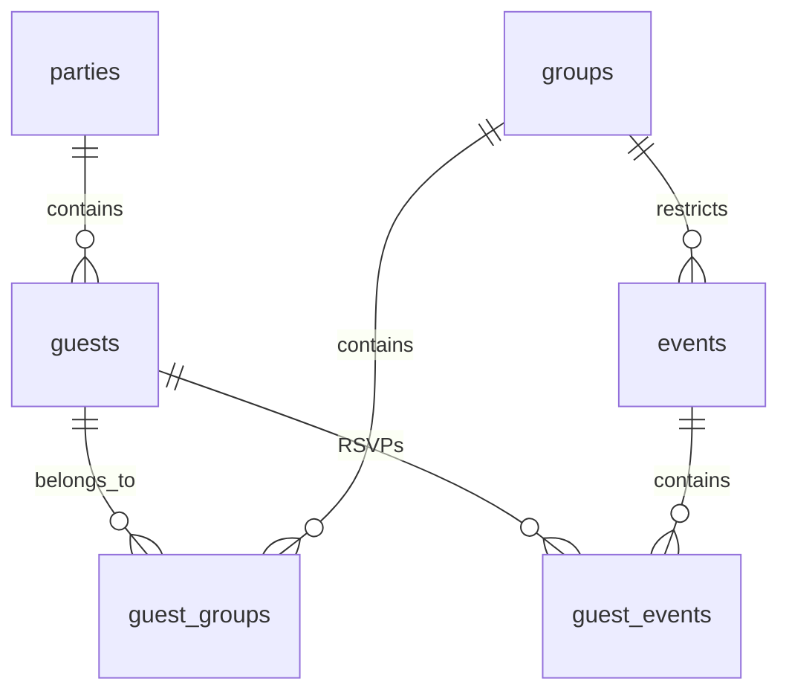

# 🗄️ Database & Schema Design Guide

This document details the database schemas, relationships, security configuration (RLS), and API endpoints used to manage guest information and events.

---

## 📊 Supabase Table Schema

The database consists of six core relational tables and one key-value configurations table:

### 1. `parties`
Represents household groupings. Guests are linked to a party to ensure they can RSVP together as a family or couple.
* `id`: `uuid` (Primary Key, defaults to `uuid_generate_v4()`)
* `name`: `text` (The household name, e.g., "The Fortini Family")

### 2. `guests`
Individual attendees.
* `id`: `uuid` (Primary Key)
* `first_name`: `text` (Given name, compared case-insensitively at login)
* `last_name`: `text` (Family name, compared case-insensitively at login)
* `email`: `text` (Optional)
* `phone`: `text` (Optional)
* `address`: `text` (Mailing address, optional)
* `rsvp_status`: `text` (RSVP response: `'attending'`, `'declined'`, or `'pending'`)
* `notes`: `text` (Dietary restrictions or optional feedback)
* `is_plus_one`: `boolean` (Indicates if the guest was added as an allocated plus-one)
* `parent_guest_id`: `uuid` (Links a plus-one guest to the main invitee who added them)
* `plus_ones_allowed`: `integer` (Number of plus-one guest additions allowed, default `0`)
* `age`: `text` (Age category: `'Adult'`, `'Child'`, or `'Infant'`)
* `needs_highchair`: `boolean`
* `in_wheelchair`: `boolean`
* `party_id`: `uuid` (Foreign Key referencing `parties.id`, cascading delete)

### 3. `groups`
A list of access segments (e.g. `Estate`, `Rehearsal Dinner`, `Bachelor Party`).
* `id`: `uuid` (Primary Key)
* `name`: `text` (Unique label)

### 4. `guest_groups`
Junction table mapping guests to access groups.
* `guest_id`: `uuid` (Foreign Key referencing `guests.id`)
* `group_id`: `uuid` (Foreign Key referencing `groups.id`)
* *Primary Key is composite:* `(guest_id, group_id)`

### 5. `events`
Event coordinates, dates, locations, and access restrictions.
* `id`: `uuid` (Primary Key)
* `title`: `text` (Event title, e.g., "Welcome Cocktail Hour")
* `description`: `text` (Details or dress codes)
* `date`: `date` (YYYY-MM-DD)
* `start_time`: `time` (HH:MM:SS)
* `end_time`: `time` (Optional)
* `location`: `text` (Physical location name)
* `dress_code`: `text`
* `is_public`: `boolean` (If `true`, all guests see it. If `false`, only members of `group_id` see it.)
* `group_id`: `uuid` (Foreign Key referencing `groups.id`, optional access gate)
* `needs_rsvp`: `boolean` (If `false`, guest RSVP checklist is hidden for this event)

### 6. `guest_events`
Junction table tracking RSVPs for specific schedule events.
* `guest_id`: `uuid` (Foreign Key referencing `guests.id`)
* `event_id`: `uuid` (Foreign Key referencing `events.id`)
* `is_attending`: `boolean` (Guest choice: `true` for attending, `false` for declining, `null` for pending)
* `meal_choice`: `text` (Dietary selections: `'chicken'`, `'fish'`, or `'veg'`)
* *Primary Key is composite:* `(guest_id, event_id)`

### 7. `site_configs`
Key-value storage for layout details, image zoom/shifts, FAQs, and portal settings.
* `key`: `text` (Primary Key, e.g., `'faq'`, `'images'`, `'general'`)
* `value`: `jsonb` (JSON data schema)
* `updated_at`: `timestamp with time zone`

---

## 🔒 Row-Level Security (RLS) Configuration

All tables have RLS enabled in Supabase to protect data from unauthorized deletes and edits.

### Public Read Access
* **Read-All**: The public anonymous client has read-only access to `parties`, `guests`, `groups`, `guest_groups`, `events`, and `guest_events` (`SELECT USING (true)`). This allows the frontend to retrieve login structures and visibility groups dynamically.

### Public Write Restrictions
* **Guests Update**: Public users can update guest RSVP information (`UPDATE CHECK (true)`).
* **Plus-One Management**: Public users are permitted to insert or delete guest records *only if* the record has `is_plus_one = true` (`INSERT WITH CHECK (is_plus_one = true)`).
* **Events Updates**: Public users can insert or update entries in `guest_events` to log their event RSVP choices (`INSERT/UPDATE WITH CHECK (true)`).
* **Configurations**: Direct public inserts, updates, or deletes to `site_configs` are entirely blocked by default.

---

## 🔌 Admin API Endpoints (Bypassing RLS)

Because public write actions are restricted, the Admin dashboard performs save actions via server-side API routes that authenticate using the private `SUPABASE_SERVICE_ROLE_KEY` (bypassing RLS):

* **`/api/save-site-config`** 💾: Performs upserts on the `site_configs` table (e.g. updating FAQs, map markers, image crop adjustments, or general parameters).
* **`/api/get-site-config`** 🔑: Securely reads configs from `site_configs` (allowing configurations to bypass client RLS blockers).
* **`/api/sync-supabase-to-local`** 🔄: An endpoint enabling administrators to trigger a JSON seed save operation directly on the container.
