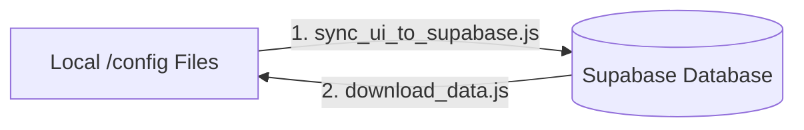

# 🚀 Deployment & Administration Workflows

This guide covers deployment pipelines, environment configuration, database backup syncs, and administrative site management.

---

## 🔑 Environment Configuration

To run the application, copy the template `.env.example` to `.env.local` and configure your API credentials.

| Key | Description | Scope |
|---|---|---|
| `NEXT_PUBLIC_SUPABASE_URL` | Supabase endpoint URL | Client & Server |
| `NEXT_PUBLIC_SUPABASE_ANON_KEY` | Public client API key (respects RLS) | Client & Server |
| `SUPABASE_SERVICE_ROLE_KEY` | Secret admin database key (bypasses RLS) | Server-only (Admin endpoints & scripts) |
| `NEXT_PUBLIC_MAPBOX_TOKEN` | Public token for loading map interfaces | Client |
| `GEMINI_API_KEY` | API key for Gemini chat models | Server-only (AI routes) |

---

## ☁️ Google Cloud Run Deployment

The production site is containerized using a multi-stage Docker build and deployed to Google Cloud Run.

### The Deployment Script (`scripts/deploy.sh`)
Running the script executes the complete build sequence:
```bash
./scripts/deploy.sh
```
1. **Configures Active Project**: Sets the active target to Google Cloud Project `wedding-497923`.
2. **Enables Cloud APIs**: Ensures Google Cloud Build, Artifact Registry, Resource Manager, and Cloud Run APIs are active.
3. **Injects Variables Dynamically**: Reads the local `.env.local` variables and injects them securely into the build environment and container environment using `gcloud run deploy --set-build-env-vars` and `--set-env-vars`, preventing hardcoded secret key leaks in source control.

---

## 🔄 Local-Cloud Synchronization Workflows

Because the administrator can edit general configurations directly in the live Admin portal, a mismatch can occur if you run a deployment that overwrites changes with local files. Use the sync scripts inside `scratch/` to manage configurations.



### 1. Downloading Cloud Changes Locally
To download the latest guest list entries, RSVP statuses, and layout configs edited on the live admin portal:
```bash
node scratch/download_data.js
```
This overwrites files in `/config/ui/` and `/config/db/` and writes a raw JSON backup file to `/database_backups/supabase_backup.json`.

### 2. Uploading Local Configs to Cloud
To override cloud database configs with local modifications:
```bash
node scratch/sync_ui_to_supabase.js
```
This updates the configs inside Supabase's `site_configs` table.

---

## 👥 Seed Database Initializations

If you are setting up a fresh Supabase database instance:
1. Copy the tables and schema from `schema.sql` into the Supabase SQL editor.
2. Enable Row-Level Security policies by executing the queries inside `supabase_rls_policies.sql`.
3. Log into your wedding website `/admin` dashboard.
4. Go to the **Backups** tab and click **Reset to JSON Seeds** to write the guest seeds (`guests.json`), event seed files (`events.json`), and visibility tags (`groups.json`) directly into the tables.
